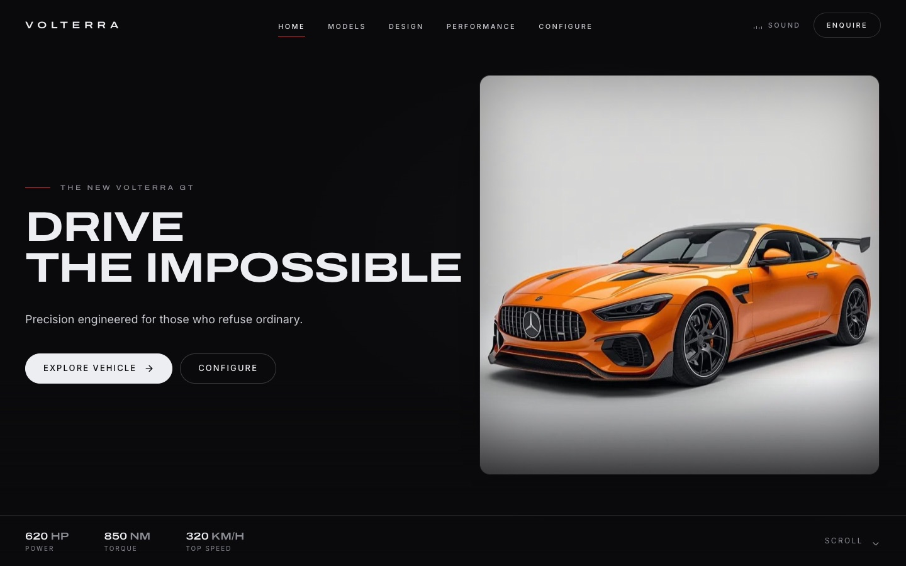
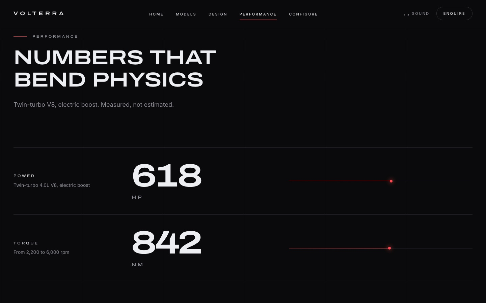
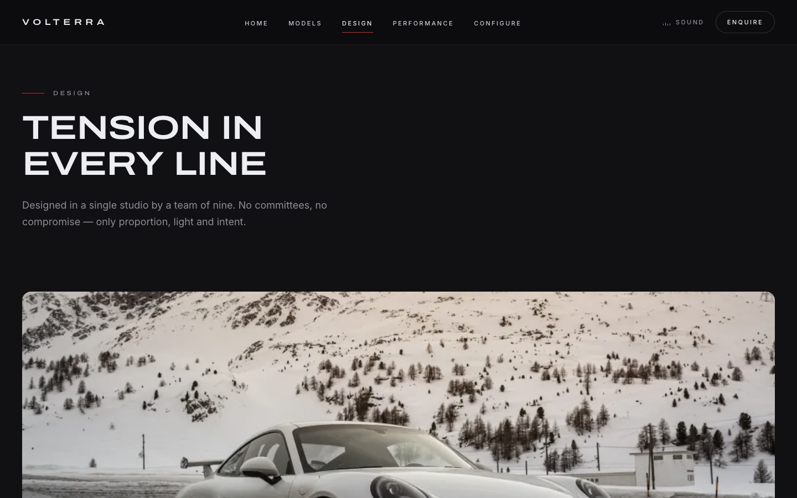
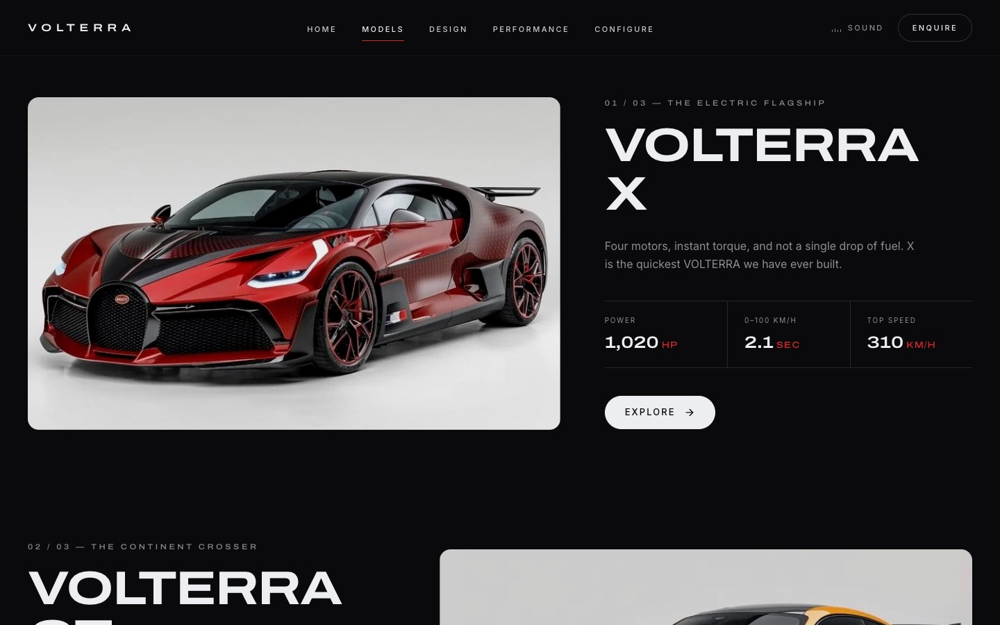
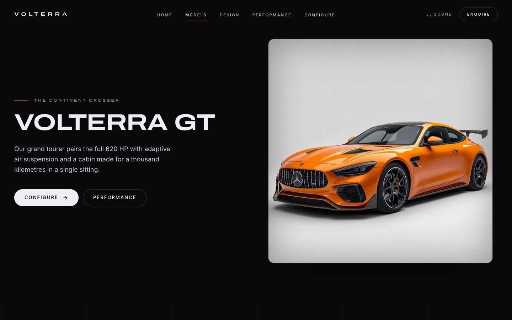
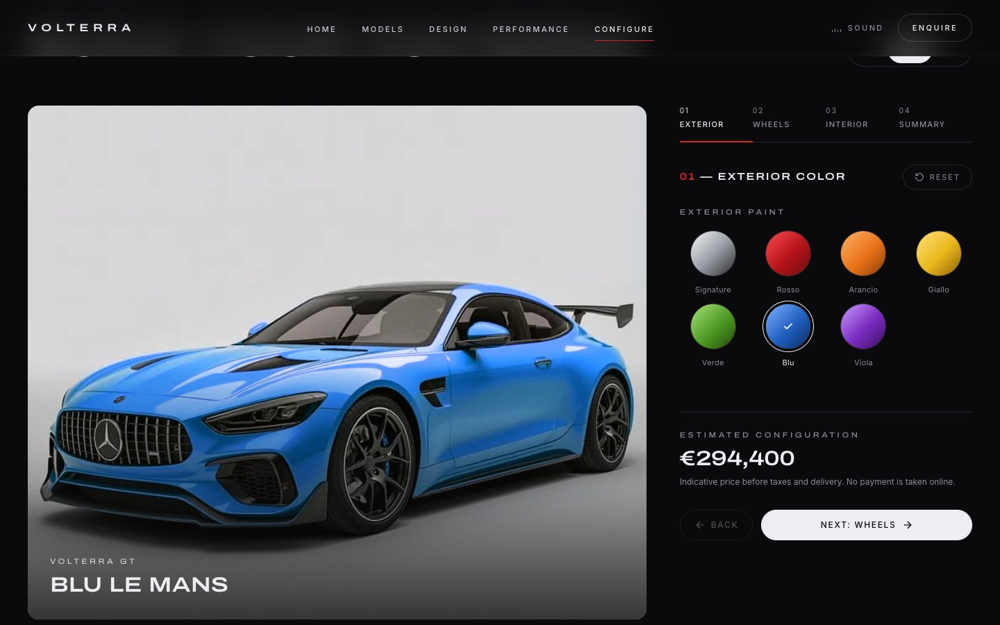
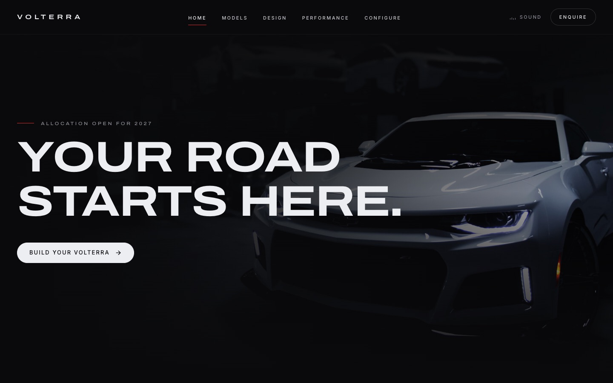
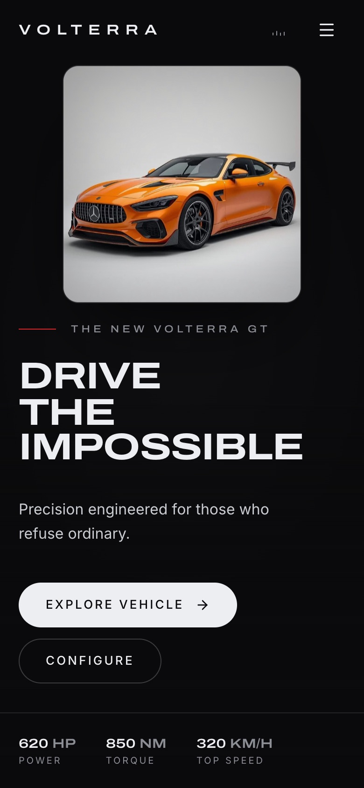

# VOLTERRA

Premium interactive automotive experience built with React, TypeScript and Framer Motion.

> VOLTERRA is an interactive automotive web experience combining React, cinematic motion design, studio vehicle photography and a vehicle configurator into a premium digital showroom.

## Overview

VOLTERRA is a concept launch site for a fictional luxury performance-car marque. Studio-lit vehicles anchor every page, cinematic image reveals carry the story, and a full configurator lets visitors choose a model, paint, wheels and interior, see an estimated price, and send a request. Everything runs in the browser on local mock data; there is no backend.

## Features

- **Studio showcase**: each model is presented on a spotlight that fades into the dark page, with crossfades between models.
- **Vehicle configurator** (`/configure`): four steps (exterior, wheels, interior, summary), live model preview, estimated price, selections saved across visits, and a validated request form.
- **Cinematic scroll animations**: masked image reveals, parallax and line-by-line text reveals.
- **Automotive model showcase**: `/models` and a detail page per model (`/models/volterra-x`, `-gt`, `-s`).
- **Responsive design** from 390px phones to 1440px desktops, including mobile step controls in the configurator.
- **Performance visualization**: count-up figures with horizontal bars, animated once on entry.
- **Interactive hotspots** on the exterior and the cockpit.
- **Mobile optimization**: 960px image variants, and touch-friendly controls.

## Tech Stack

- React
- TypeScript
- Vite
- Framer Motion
- Tailwind CSS
- Lucide React

## Architecture

```
src/
  pages/              Route pages: Home, ModelsPage, ModelDetail, ConfigurePage, NotFound
  sections/           Page sections reused across routes (Hero, Performance, Design, Interior, Configurator, RequestForm, …)
  components/layout/  Navbar, Footer, Logo/Wordmark
  components/ui/      Reusable UI: Button, CarStage, CinematicBand, ParallaxImage, SmartImage, Reveal, StaggerText, Counter, Preloader, …
  data/               content.ts: single source for copy, model specs and configurator options; images.ts: image size manifest
  state/              Small external stores: car configuration (persisted) and intro state
  hooks/ utils/       useMediaQuery; analytics integration point
  router.ts           Minimal History API router (no dependency)
public/
  assets/images/      hero/ exterior/ interior/ details/ models/ social/ (WebP, with 960px variants)
```

- **One data source.** Each model's performance record in `data/content.ts` drives the models page, model details, configurator and performance bars, through the `modelStats` and `modelSpecs` helpers.
- **One showcase component.** `StudioShot` presents every model photo (hero, model pages, configurators). The configuration store keeps every view in sync with the selected model and options.
- **Routing.** Plain `<a href>` links are intercepted for client-side navigation. Secondary routes are code-split with `React.lazy`.

## Performance

- **Lazy loading:** routes are code-split and images load lazily.
- **Optimized images:** WebP with 960px variants through `srcset`, intrinsic width and height to avoid layout shift, and a fade-in once loaded.
- **Reduced motion support:** parallax, magnetic buttons and CSS loops are disabled, and transitions are simplified.
- **Code splitting:** each secondary route ships as a separate chunk.

## Development

```bash
npm install
npm run dev
```

## Production

```bash
npm run build
```

The output goes to `dist/`. `public/_redirects` provides the SPA fallback on Netlify. On other hosts, rewrite all routes to `/index.html`.

## Demo

**Live:** https://volterra-showroom.netlify.app

## Screenshots

| Hero | Performance |
| ---- | ----------- |
|  |  |
| **Design** | **Models** |
|  |  |
| **Model details** | **Configurator** |
|  |  |
| **Final CTA** | **Mobile** |
|  |  |

## Credits

Photography from [Unsplash](https://unsplash.com). Vehicles of real manufacturers appear in the photos; VOLTERRA itself is fictional.
